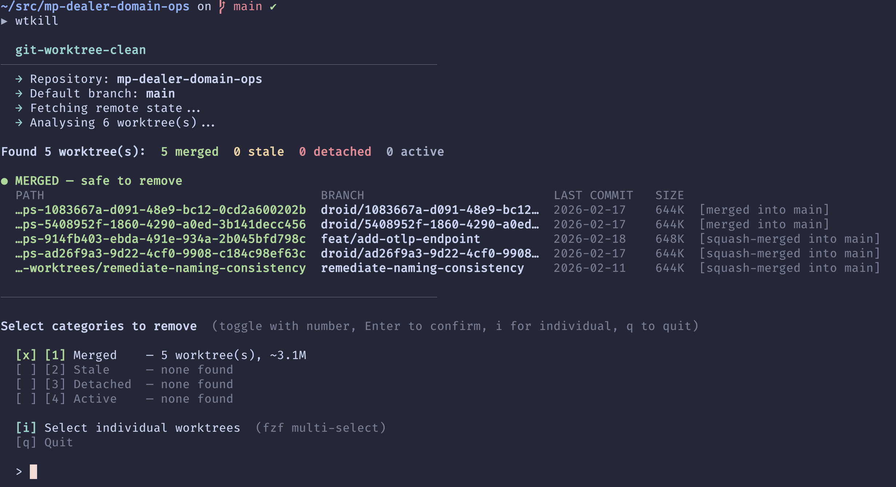

# wtkill

Interactive TUI for cleaning up git worktrees.

Scans your repository for worktrees that are merged, stale, or detached and lets you remove them in bulk or individually — without touching your active work.



## Features

- Detects merged branches (including squash-merges)
- Detects remote-gone branches and detached HEADs
- Marks worktrees with no recent commits as stale
- Category-based bulk removal or individual selection via `fzf`
- Dry-run mode to preview what would be removed
- Configurable stale threshold
- Colored terminal output (degrades gracefully in non-TTY environments)

## Requirements

- [bash](https://www.gnu.org/software/bash/) >= 4
- [git](https://git-scm.com/)
- [fzf](https://github.com/junegunn/fzf)

## Installation

**One-liner:**

```sh
curl -fsSL https://raw.githubusercontent.com/mbensch/wtkill/main/install.sh | bash
```

**Manual:**

```sh
git clone https://github.com/mbensch/wtkill.git
cd wtkill
bash install.sh
```

By default `wtkill` is installed to `~/.local/bin`. Override with `PREFIX`:

```sh
PREFIX=/usr/local/bin bash install.sh
```

If the install directory is not on your `$PATH`, the script will tell you how to add it.

## Usage

```
wtkill [OPTIONS]
```

| Option | Description |
|---|---|
| `--dry-run` | Show what would be removed without deleting anything |
| `--no-fetch` | Skip `git fetch --prune` |
| `--report-only` | Print classification summary and exit (non-interactive) |
| `--stale-days=N` | Days of inactivity before a worktree is considered stale (default: 14) |
| `--update` | Update wtkill to the latest release |
| `--version`, `-V` | Print version and exit |
| `--help`, `-h` | Print help and exit |

**Environment variable:**

| Variable | Description |
|---|---|
| `GIT_WT_CLEAN_STALE_DAYS` | Override the default stale-days threshold |

## How it works

1. Optionally runs `git fetch --prune` to sync remote state.
2. Parses all worktrees via `git worktree list --porcelain`.
3. Classifies each worktree as **merged**, **stale**, **detached**, or **active** based on merge status, squash-merge detection, remote branch existence, and last commit date.
4. Presents an interactive menu to toggle categories for bulk removal, or launches `fzf` for individual selection.
5. Removes selected worktrees with `git worktree remove --force` and runs `git worktree prune`.

## Development

Lint with [ShellCheck](https://www.shellcheck.net/):

```sh
shellcheck wtkill install.sh
```

Run tests with [bats](https://github.com/bats-core/bats-core):

```sh
bats test/
```

Both run automatically on every PR via GitHub Actions.

## License

[MIT](LICENSE)
